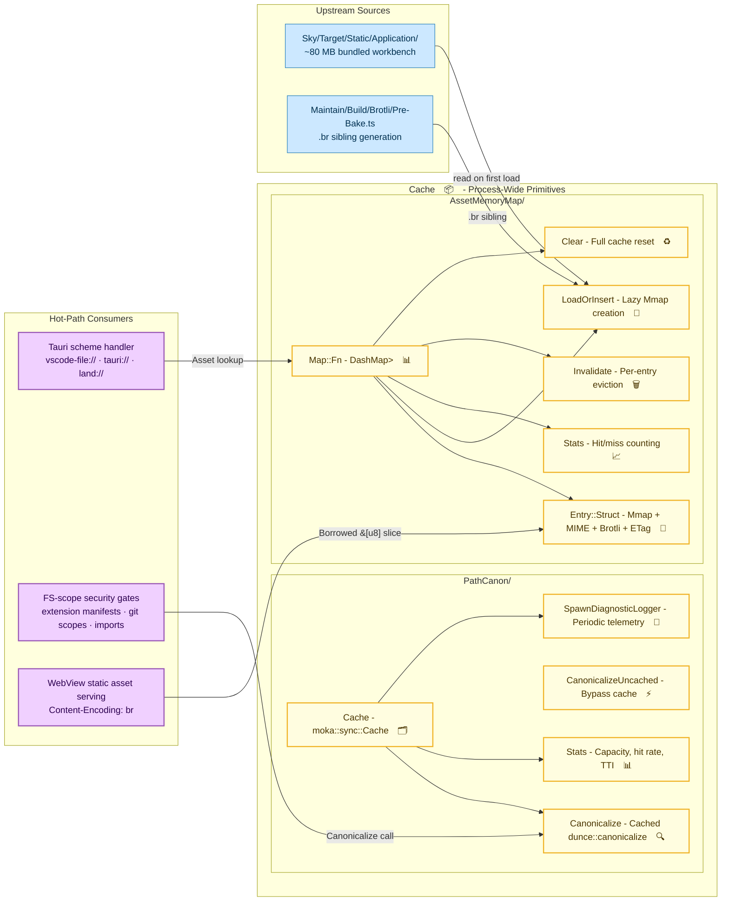

# **Cache**&#x2001;📦

<table>
	<tr>
		<td>
			<a href="https://GitHub.Com/CodeEditorLand/Cache" target="_blank">
				<picture>
					<source media="(prefers-color-scheme: dark)" srcset="https://img.shields.io/github/last-commit/CodeEditorLand/Cache?label=Update&color=black&labelColor=black&logoColor=white&logoWidth=0" />
					<source media="(prefers-color-scheme: light)" srcset="https://img.shields.io/github/last-commit/CodeEditorLand/Cache?label=Update&color=white&labelColor=white&logoColor=black&logoWidth=0" />
					
				</picture>
			</a>
			<br />
			<a href="https://GitHub.Com/CodeEditorLand/Cache" target="_blank">
				<picture>
					<source media="(prefers-color-scheme: dark)" srcset="https://img.shields.io/github/issues/CodeEditorLand/Cache?label=Issue&color=black&labelColor=black&logoColor=white&logoWidth=0" />
					<source media="(prefers-color-scheme: light)" srcset="https://img.shields.io/github/issues/CodeEditorLand/Cache?label=Issue&color=white&labelColor=white&logoColor=black&logoWidth=0" />
					
				</picture>
			</a>
		</td>
		<td>
			<a href="https://github.com/CodeEditorLand/Cache" target="_blank">
				<picture>
					<source media="(prefers-color-scheme: dark)" srcset="https://img.shields.io/github/stars/CodeEditorLand/Cache?style=flat&label=Star&logo=github&color=black&labelColor=black&logoColor=white&logoWidth=0" />
					<source media="(prefers-color-scheme: light)" srcset="https://img.shields.io/github/stars/CodeEditorLand/Cache?style=flat&label=Star&logo=github&color=white&labelColor=white&logoColor=black&logoWidth=0" />
					
				</picture>
			</a>
			<br />
			<a href="https://GitHub.Com/CodeEditorLand/Cache" target="_blank">
				<picture>
					<source media="(prefers-color-scheme: dark)" srcset="https://img.shields.io/github/downloads/CodeEditorLand/Cache/total?label=Download&color=black&labelColor=black&logoColor=white&logoWidth=0" />
					<source media="(prefers-color-scheme: light)" srcset="https://img.shields.io/github/downloads/CodeEditorLand/Cache/total?label=Download&color=white&labelColor=white&logoColor=black&logoWidth=0" />
					
				</picture>
			</a>
		</td>
	</tr>
</table>

Process-Wide Caching Primitives for Land&#x2001;🏞️

> **Every time the editor serves a static JavaScript file from the ~80 MB
> workbench bundle, it reads the file from disk, copies the bytes into a new
> buffer, and hands it to the webview. Repeat this hundreds of times per session
> and the overhead adds up. Meanwhile, operations that check whether a file path
> is "safe" run the same path resolution over and over - each one hitting the
> filesystem. A naive in-memory copy of every file would just duplicate what the
> operating system already keeps in its own page cache.**
>
> _\"Cache maps files directly into memory so the webview reads them without a
> copy. Canonical paths get resolved once and remembered. Both caches are
> optional - everything still works if you turn them off, it's just slower.\"_

[](https://github.com/CodeEditorLand/Cache/tree/Current/LICENSE)
[](https://www.rust-lang.org/)&#x2001;[](https://crates.io/crates/Cache)
[](https://www.rust-lang.org/)&#x2001;[](https://www.rust-lang.org/)
[](https://github.com/moka-rs/moka)
[](https://github.com/RazrFalcon/memmap2-rs)

**[Rust API Documentation](https://rust.documentation.cache.editor.land/)**&#x2001;📖

---

## Overview

**Cache** speeds up the editor by remembering work it has already done, so it
doesn't repeat it. It provides two independent caches that anyone in the Land
application can use.

The first cache handles **static assets** - the JavaScript, CSS, and font files
that make up the editor's user interface. Normally, every time the webview
requests one of these files, the application reads it from disk, allocates a new
buffer, and copies the bytes in. Under the hood, the operating system is already
keeping those file pages in memory. Cache uses `memmap2` to hand the webview a
direct view into those OS-managed pages, skipping the read-copy-allocate cycle
entirely. It also automatically finds pre-compressed `.br` (Brotli) versions of
each file, so the editor can serve smaller responses without compressing on the
fly.

The second cache handles **file paths**. The editor frequently needs to resolve
a relative or symlinked path to its absolute, canonical form - especially when
deciding whether a file operation is allowed. A single path might be resolved
dozens of times during startup as extensions load, imports resolve, and security
checks run. Cache remembers each resolution in a fast in-memory store (`moka`),
so subsequent lookups for the same path return instantly from a hash table
rather than hitting the filesystem again. Entries that haven't been accessed in
60 seconds are automatically removed, so stale results don't linger.

Both caches are purely additive. If you disable either one - or both - every
operation still produces the correct result. Things just take a little longer.

**Cache is engineered to:**

1. **Skip repeated disk reads for assets** - When the webview asks for a static
   file that's already been loaded, hand it a direct memory reference instead of
   reading the file again and copying the bytes into a new buffer.
2. **Remember path resolutions** - The first time a path is canonicalised, run
   the filesystem check. After that, return the remembered answer from a hash
   table until 60 seconds have passed without anyone asking for it.
3. **Keep hot data hot, let cold data expire** - Paths that get accessed
   constantly stay cached. Paths checked once during startup naturally expire
   after 60 seconds of inactivity. If someone renames a file, the old cached
   path ages out within a minute.
4. **Detect and serve compressed files automatically** - When pre-compressed
   `.br` siblings exist alongside assets, Cache loads them alongside the
   original. Scheme handlers can then serve the smaller compressed version when
   the browser says it supports Brotli, without running a compressor on every
   request.

---

## Key Features&#x2001;⚙️

**Memory-Mapped Asset Cache** - The `AssetMemoryMap` is a shared, thread-safe
dictionary that maps file paths to their contents. Each entry holds the file's
bytes as a memory-mapped region (no copy), the MIME type guessed from the file
extension, the file size, an optional pre-compressed Brotli version, and a cache
validator (`ETag`). Scheme handlers for `vscode-file://`, `tauri://`, and
`land://` look up files here and get a ready-to-serve response without touching
the disk again.

**Automatic Brotli Handling** - When a file is first loaded, Cache checks
whether a `.br` sibling exists next to it (these are pre-generated by the
`Maintain` build system). If one is found, it's loaded alongside the original.
When the webview sends `Accept-Encoding: br`, the scheme handler serves the
pre-compressed bytes directly - no runtime compression needed.

**Canonical Path Cache** - The path cache stores up to 8 192 path resolutions.
Each entry lives for 60 seconds after its last use. Frequently accessed paths
stay cached for the entire session; one-off lookups expire naturally. Two
functions are exposed: `Canonicalize` (checks the cache first, resolves on miss)
and `CanonicalizeUncached` (always goes to the filesystem, for when a fresh
answer is required).

**Lock-Free Concurrent Reads** - The asset cache uses `DashMap`, which splits
its internal storage into independently locked shards. Multiple threads can read
different entries simultaneously without waiting on each other. The path cache
uses `moka`, which achieves similar concurrency through careful internal design.
Both caches are safe to use from any number of threads.

**Cache Inspection and Reset** - Both caches expose statistics (hit count, miss
count, capacity, time-before-expiry) and support manual operations: clear the
entire cache, or invalidate a specific entry. This is useful during development
when files change and you want the cache to pick up new content immediately.

---

## Core Architecture Principles&#x2001;🏗️

| Principle                | Description                                                                                                                                                                             | Key Components                                                                               |
| ------------------------ | --------------------------------------------------------------------------------------------------------------------------------------------------------------------------------------- | -------------------------------------------------------------------------------------------- |
| **Zero-Copy Serving**    | Serve static assets as borrowed `&[u8]` slices of `memmap2::Mmap` regions. No per-request allocation, no kernel page cache duplication, no GC pressure.                                 | `AssetMemoryMap::Entry::Struct`, `memmap2::Mmap`, `AssetMemoryMap::Map::Fn`                  |
| **Additive Performance** | Both caches are transparent acceleration layers. Consumers continue to function identically - just slower - with either or both caches disabled.                                        | `AssetMemoryMap::LoadOrInsert`, `PathCanon::Canonicalize`, `PathCanon::CanonicalizeUncached` |
| **Bounded Staleness**    | `time_to_idle` semantics bound the freshness of cached data. Hot paths reset the timer; cold paths evict naturally. External mutations converge in ≤60s.                                | `moka::sync::Cache<PathBuf, PathBuf>`, `time_to_idle = Duration::from_secs(60)`              |
| **Thread Safety**        | `DashMap` for concurrent asset reads with wait-free sharding. `moka` for concurrent path reads with amortised lock-free access. `OnceLock` / `Lazy` for one-time global initialisation. | `DashMap<PathBuf, Arc<Entry::Struct>>`, `Lazy<moka::sync::Cache>`, `OnceLock`                |

---

## System Architecture&#x2001;



**Connection paths:**

| Path                                  | Mechanism                       | Use Case                                              |
| ------------------------------------- | ------------------------------- | ----------------------------------------------------- |
| Scheme handler → `AssetMemoryMap`     | `DashMap::get` / `LoadOrInsert` | Serve `vscode-file://`, `tauri://`, `land://` assets  |
| WebView → Entry `&[u8]`               | Borrowed `Mmap` slice           | Zero-copy response body for static JS/CSS/fonts       |
| FS security gate → `PathCanon`        | `Cache::get` → hash lookup      | Extension manifest paths, scope checks, chunk imports |
| `PathCanon` → `dunce::canonicalize`   | Fallback on cache miss          | First-time or stale-path resolution                   |
| Disk → `AssetMemoryMap::LoadOrInsert` | `memmap2::Mmap` + sibling check | Initial load + Brotli sibling discovery               |

---

## Key Components

| Component             | Path                                         | Description                                                                 |
| --------------------- | -------------------------------------------- | --------------------------------------------------------------------------- |
| Library Entry         | `Source/Library.rs`                          | Crate root, declares `AssetMemoryMap` and `PathCanon` modules               |
| Asset Memory Map      | `Source/AssetMemoryMap.rs`                   | Module root: `memmap2`-backed asset cache with Brotli transparency          |
| Map                   | `Source/AssetMemoryMap/Map.rs`               | Process-global `DashMap<PathBuf, Arc<Entry::Struct>>` via `OnceLock`        |
| Entry                 | `Source/AssetMemoryMap/Entry.rs`             | Per-asset struct: `Mmap`, MIME, length, optional Brotli `Mmap`, weak `ETag` |
| Load or Insert        | `Source/AssetMemoryMap/LoadOrInsert.rs`      | Lazy `Mmap` creation with Brotli sibling auto-detection                     |
| Cache Stats (Asset)   | `Source/AssetMemoryMap/CacheStats.rs`        | Hit/miss counters and cache telemetry                                       |
| Invalidate (Asset)    | `Source/AssetMemoryMap/Invalidate.rs`        | Per-entry eviction from the asset cache                                     |
| Clear (Asset)         | `Source/AssetMemoryMap/Clear.rs`             | Full asset cache reset                                                      |
| MIME from Extension   | `Source/AssetMemoryMap/MimeFromExtension.rs` | Extension-to-MIME lookup function                                           |
| Path Canon            | `Source/PathCanon.rs`                        | Module root: `moka`-based canonical-path cache                              |
| Cache                 | `Source/PathCanon/Cache.rs`                  | `Lazy<moka::sync::Cache<PathBuf, PathBuf>>` with 8 192 cap, 60s TTI         |
| Canonicalize          | `Source/PathCanon/Canonicalize.rs`           | Cached `dunce::canonicalize` - checks cache, falls through on miss          |
| Canonicalize Uncached | `Source/PathCanon/CanonicalizeUncached.rs`   | Bypass-cache `dunce::canonicalize` for forced fresh resolution              |
| Invalidate (Path)     | `Source/PathCanon/Invalidate.rs`             | Per-path eviction from the canonical-path cache                             |
| Clear (Path)          | `Source/PathCanon/Clear.rs`                  | Full canonical-path cache reset                                             |
| Diagnostic Logger     | `Source/PathCanon/SpawnDiagnosticLogger.rs`  | Periodic telemetry emission for cache statistics                            |

---

## Project Structure&#x2001;🗺️

```
Element/Cache/
├── Source/
│   ├── Library.rs                        # Crate root, module declarations
│   ├── AssetMemoryMap.rs                 # Asset cache module root
│   │   ├── Map.rs                        # DashMap<PathBuf, Arc<Entry::Struct>> singleton
│   │   ├── Entry.rs                      # Mmap + MIME + Brotli + ETag struct
│   │   ├── LoadOrInsert.rs               # Lazy load with Brotli sibling detection
│   │   ├── CacheStats.rs                 # Hit/miss counters
│   │   ├── Invalidate.rs                 # Per-entry eviction
│   │   ├── Clear.rs                      # Full cache reset
│   │   ├── Stats.rs                      # Aggregated statistics
│   │   └── MimeFromExtension.rs          # Extension-to-MIME resolver
│   └── PathCanon.rs                      # Path canonicalisation cache module root
│       ├── Cache.rs                      # moka::sync::Cache static (8 192 cap, 60s TTI)
│       ├── Canonicalize.rs               # Cached dunce::canonicalize
│       ├── CanonicalizeUncached.rs       # Uncached dunce::canonicalize
│       ├── CacheStats.rs                 # Cache statistics
│       ├── Invalidate.rs                 # Per-path eviction
│       ├── Clear.rs                      # Full cache reset
│       ├── Stats.rs                      # Hit/miss/capacity reporting
│       └── SpawnDiagnosticLogger.rs      # Periodic telemetry emitter
├── Documentation/
│   └── Rust/
│       └── doc/                          # Cargo doc output
└── Cargo.toml
```

---

## In the Land Project

Cache speeds up the editor by remembering results that would otherwise be
recomputed. It never changes what happens - only how fast.

- **Scheme handlers** (`vscode-file://`, `tauri://`, `land://`) look up static
  files in the asset cache instead of reading them from disk. When the browser
  supports Brotli, a pre-compressed version is served automatically.
- **File-system security checks** resolve every incoming path through the path
  cache. During a typical startup, this saves roughly 150 milliseconds by
  avoiding repeated filesystem lookups for extension manifests (~113 paths),
  JavaScript imports (~80 paths), and git scope checks (~60 paths).

| Consumer               | Cache Used       | Hot-Path Pattern                                                      |
| ---------------------- | ---------------- | --------------------------------------------------------------------- |
| **Mountain**&#x2001;⛰️ | `AssetMemoryMap` | Scheme handler asset serving to `Sky`/`Wind` WebView                  |
| **Mountain**&#x2001;⛰️ | `PathCanon`      | FS-scope security gates - extension paths, git scopes, file imports   |
| **Wind**&#x2001;🍃     | `AssetMemoryMap` | Per-body zero-copy response in `Content-Type: application/javascript` |
| **Maintain**&#x2001;💪🏻 | `AssetMemoryMap` | Brotli sibling pre-bake - `.br` files loaded by LoadOrInsert          |

### Key Dependencies

| Crate       | Purpose                                                    |
| ----------- | ---------------------------------------------------------- |
| `dashmap`   | Concurrent hashmap for asset cache - wait-free reads       |
| `memmap2`   | Memory-mapped file I/O - zero-copy asset serving           |
| `moka`      | High-performance concurrent cache - canonical-path storage |
| `dunce`     | Canonical path resolution on Windows                       |
| `once_cell` | `Lazy` / `OnceLock` for process-global singleton init      |
| `tokio`     | Async runtime for diagnostic logger spawning               |
| `log`       | Diagnostic logging via `SpawnDiagnosticLogger`             |

---

## Getting Started&#x2001;🚀

### Prerequisites

- **Rust** 1.95 or later (edition 2024)

### As a Library

Add Cache to your project via the Land workspace:

```toml
[dependencies]
Cache = { git = "https://github.com/CodeEditorLand/Cache.git", branch = "Current" }
```

### Usage

```rust
use std::path::PathBuf;
use Cache::AssetMemoryMap::{Map, LoadOrInsert};

// Obtain the process-global asset cache
let Map = Map::Fn();

// Load or get a cached asset entry
let Entry = LoadOrInsert::Fn(Map, &PathBuf::from("path/to/asset.js"))?;

// Serve the bytes directly - zero copy
let Body: &[u8] = Entry.AsSlice();

// Serve Brotli-compressed sibling if available
if let Some(BrBody) = Entry.AsBrotliSlice() {
    // Set Content-Encoding: br, Content-Length: Entry.BrotliLength()
}
```

```rust
use Cache::PathCanon::Canonicalize;

// Cached canonical-path resolution
let Canonical = Canonicalize::Fn(PathBuf::from("relative/path"))?;

// Force fresh resolution, bypassing the cache
let Fresh = Cache::PathCanon::CanonicalizeUncached::Fn(PathBuf::from("relative/path"))?;
```

---

## Security&#x2001;🔒

| Layer                      | Mechanism                                                                                                                               |
| -------------------------- | --------------------------------------------------------------------------------------------------------------------------------------- |
| **Additive, not Critical** | Both caches are transparent layers. If a cache is poisoned or disabled, consumers fall through to direct I/O with zero semantic change. |
| **Bounded Staleness**      | `time_to_idle = 60s` bounds the window for stale data. Hot paths that matter stay current; cold paths age out naturally.                |
| **Safe Rust**              | No `unsafe` code outside of `memmap2`'s platform abstractions. All public APIs use safe `Rust` types and ownership semantics.           |
| **Thread Safety**          | `DashMap` and `moka` provide proven concurrent access patterns. No shared mutable state without synchronisation.                        |

---

## Compatibility

Cache is designed to integrate with:

| Target                 | Integration                                                                                               |
| ---------------------- | --------------------------------------------------------------------------------------------------------- |
| **Mountain**&#x2001;⛰️ | Primary consumer - scheme handler asset serving and fs-scope security gates                               |
| **Wind**&#x2001;🍃     | Zero-copy response body serving via WebView scheme handlers                                               |
| **Maintain**&#x2001;💪🏻 | Brotli sibling pre-bake pipeline - `.br` files auto-loaded by `LoadOrInsert`                              |
| **Any Land embedder**  | `AssetMemoryMap` and `PathCanon` are embedder-agnostic - consume from any Rust crate via cargo dependency |

---

## API Reference

- **[Rust API Documentation](https://rust.documentation.cache.editor.land/)**&#x2001;📖

---

## Related Documentation

- [Architecture Overview](https://Editor.Land/Doc/architecture) - Land&#x2001;🏞️
  system architecture
- [Mountain](https://github.com/CodeEditorLand/Mountain)&#x2001;⛰️ - Primary
  consumer, Tauri native desktop shell
- [Wind](https://github.com/CodeEditorLand/Wind)&#x2001;🍃 - Service layer
  consuming zero-copy asset slices
- [Maintain](https://github.com/CodeEditorLand/Maintain)&#x2001;💪🏻 - Build
  system generating Brotli siblings
- [Land Documentation Index](https://Editor.Land/Doc) - Full documentation index

---

## License&#x2001;⚖️

This project is released into the public domain under the **Creative Commons CC0
Universal** license. You are free to use, modify, distribute, and build upon
this work for any purpose, without any restrictions. For the full legal text,
see the
[`LICENSE`](https://github.com/CodeEditorLand/Cache/tree/Current/LICENSE) file.

---

## Changelog&#x2001;📜

See
[`CHANGELOG.md`](https://github.com/CodeEditorLand/Cache/tree/Current/CHANGELOG.md)
for a history of changes specific to **Cache**&#x2001;📦.

---

## Funding & Acknowledgements&#x2001;🙏🏻

This project is funded through
[NGI0 Commons Fund](https://NLnet.NL/commonsfund), a fund established by
[NLnet](https://NLnet.NL) with financial support from the European Commission's
Next Generation Internet program, under grant agreement No 101135429.

The project is operated by PlayForm, based in Sofia, Bulgaria. PlayForm acts as
the open-source steward for Code Editor Land under the NGI0 Commons Fund grant.

<table>
	<tbody>
		<tr>
			<td align="left" valign="middle"><a href="https://Editor.Land"></a></td>
			<td align="left" valign="middle"><a href="https://PlayForm.Cloud"></a></td>
			<td align="left" valign="middle"><a href="https://NLnet.NL"></a></td>
			<td align="left" valign="middle"><a href="https://NLnet.NL/commonsfund"></a></td>
		</tr>
	</tbody>
</table>

---

**Project Maintainers**: Source Open
([Source/Open@editor.land](mailto:Source/Open@editor.land)) |
[GitHub Repository](https://github.com/CodeEditorLand/Cache) |
[Report an Issue](https://github.com/CodeEditorLand/Cache/issues) |
[Security Policy](https://github.com/CodeEditorLand/Cache/security/policy)
